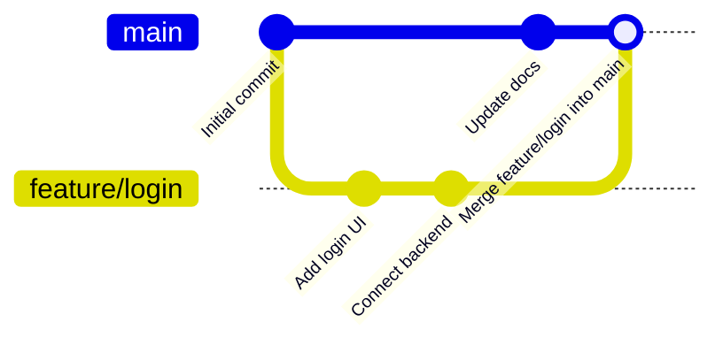
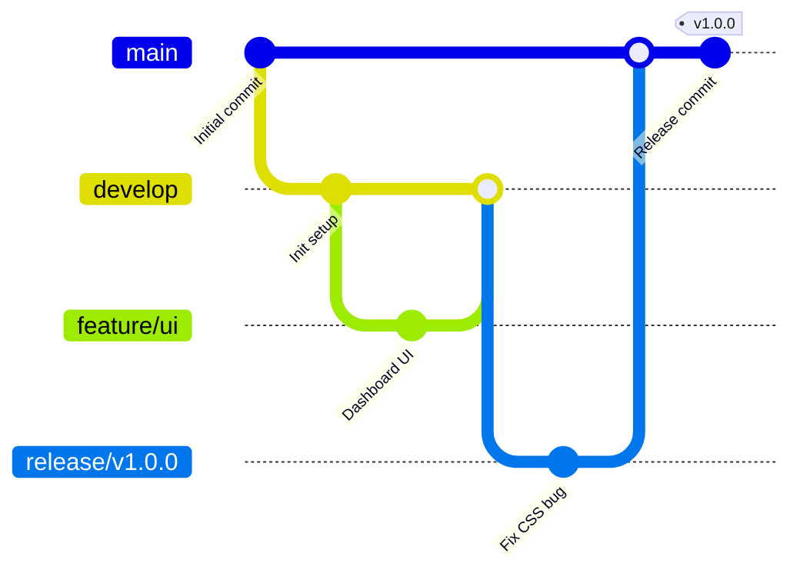
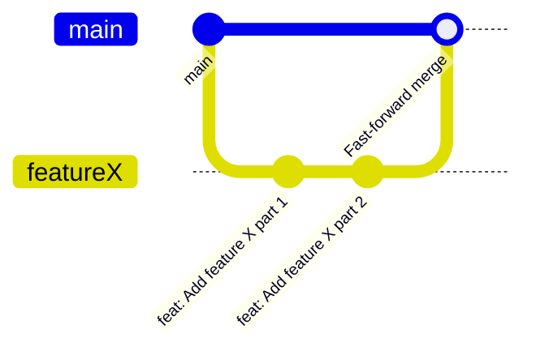
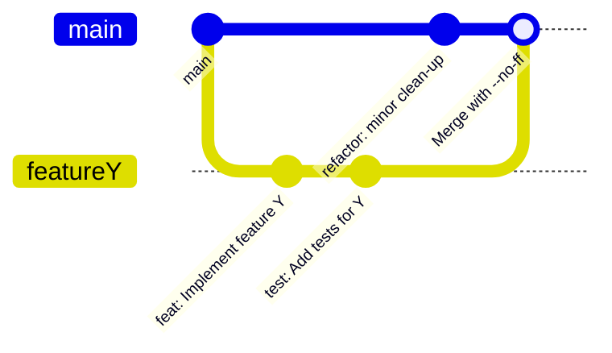
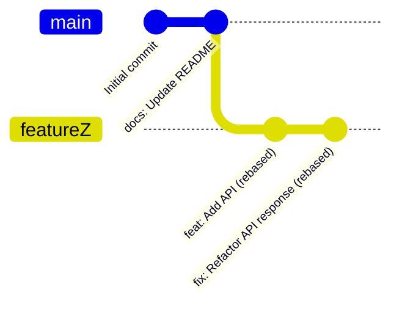
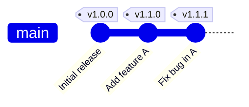

# Git Best Practices

- This guide offers practical, professional advice for using Git in software projects. 
- It covers commit hygiene, branching strategies, merging workflows, tagging releases, and maintaining repository cleanliness. 
- Each section is designed to help you write better history for both your future self and your teammates.

---

## 1. Git Configuration

Start by telling Git who you are and what your preferred workflow looks like:

```bash
git config --global user.name "Your Name"
git config --global user.email "you@example.com"
git config --global core.editor "code --wait"
git config --global pull.rebase true
git config --global init.defaultBranch main
```

---

## 2. Writing Good Commits

### 2.1 Atomic Commits

- Each commit should contain a single logical change.
- Avoid bundling multiple changes together.

### 2.2 Commit Message Structure

- Follow the conventional commit format:

    ```sh
    <type>(scope): short description

    Optional longer explanation
    ```

- Examples:

  * `feat(auth): add Google login support`
  * `fix(api): handle missing token errors`
  * `docs: update contribution guide`

### 2.3 Selective Staging

Use `git add -p` to stage only what you intend to commit.

---

## 3. Branching Strategy

### 3.1 Naming Conventions

Use meaningful and consistent names:

* `feature/user-auth`
* `bugfix/payment-validation`
* `hotfix/logging-crash`

### 3.2 GitHub Flow

A simple workflow ideal for continuous integration:



### 3.3 Git Flow

Recommended for release-based products:



---

## 4. Merging and Rebasing

### 4.1 Fast-Forward Merge

Linear and clean history:

```bash
git checkout main
git merge feature/branch
```



### 4.2 Merge Commit

Keeps the branch's history:

```bash
git merge --no-ff feature/branch -m "Merge feature branch"
```



### 4.3 Rebase

Use locally to clean up your branch:

```bash
git checkout feature/branch
git rebase main
```



> Avoid rebasing branches others may have already pulled.

---

## 5. Tagging Releases

Use tags to mark release points:

```bash
git tag -a v1.0.0 -m "Release v1.0.0"
git push origin v1.0.0
```

Follow Semantic Versioning: `MAJOR.MINOR.PATCH`



---

## 6. Pull Requests & Code Reviews

Before submitting a PR:

* Rebase to clean up history (if local)
* Use a descriptive title and summary
* Keep the scope focused
* Link relevant issues or tickets
* Ensure all tests and CI pass

---

## 7. Repository Hygiene

### 7.1 Squash Commits

Use interactive rebase before merging to tidy up:

```bash
git rebase -i HEAD~5
```

### 7.2 Delete Merged Branches

```bash
git branch -d feature/branch
git push origin --delete feature/branch
```

---

## 8. Useful Git Commands

| Command                     | Description                               |
| --------------------------- | ----------------------------------------- |
| `git log --oneline --graph` | Visualize history                         |
| `git diff`                  | See changes                               |
| `git stash`                 | Save uncommitted work                     |
| `git reflog`                | Browse HEAD changes                       |
| `git cherry-pick <commit>`  | Apply a specific commit elsewhere         |
| `git bisect`                | Identify the commit that introduced a bug |

---

## 9. Summary Table

| Area        | Best Practice                                     |
| ----------- | ------------------------------------------------- |
| Commits     | Atomic and meaningful with consistent messages    |
| Branching   | Short-lived and well-named                        |
| Merging     | Rebase for cleanup, merge for shared branches     |
| Tagging     | Use annotated tags with semantic versioning       |
| Reviews     | Enforce CI, focused PRs, and code review policies |
| Maintenance | Squash noisy commits, delete stale branches       |


###  Configuration & Setup

| Command                                              | Description                            |
| ---------------------------------------------------- | -------------------------------------- |
| `git config --global user.name "Name"`               | Set your name globally                 |
| `git config --global user.email "email@example.com"` | Set your email globally                |
| `git config --global core.editor "editor"`           | Set default editor (e.g., VS Code)     |
| `git config --global pull.rebase true`               | Enable rebase instead of merge on pull |
| `git config --global init.defaultBranch main`        | Use `main` as default branch           |

---

###  Repository Initialization & Cloning

| Command                       | Description               |
| ----------------------------- | ------------------------- |
| `git init`                    | Initialize a new Git repo |
| `git clone <url>`             | Clone a remote repository |
| `git remote -v`               | Show remote URLs          |
| `git remote add origin <url>` | Add a remote origin       |

---

###  Status & Logs

| Command                     | Description                              |
| --------------------------- | ---------------------------------------- |
| `git status`                | Show current status                      |
| `git log`                   | Show commit history                      |
| `git log --oneline`         | One-line summary per commit              |
| `git log --oneline --graph` | Visual graph view of branches            |
| `git reflog`                | Show local branch history (even deleted) |

---

### Staging & Committing

| Command               | Description               |
| --------------------- | ------------------------- |
| `git add <file>`      | Stage a file              |
| `git add .`           | Stage all modified files  |
| `git add -p`          | Interactively stage hunks |
| `git commit -m "msg"` | Commit staged changes     |
| `git commit --amend`  | Modify last commit        |

---

### Branching & Checkout

| Command                           | Description                     |
| --------------------------------- | ------------------------------- |
| `git branch`                      | List branches                   |
| `git branch <name>`               | Create a new branch             |
| `git checkout <name>`             | Switch to branch                |
| `git checkout -b <name>`          | Create and switch to new branch |
| `git branch -d <name>`            | Delete a local branch           |
| `git push origin --delete <name>` | Delete remote branch            |

---

### Merging & Rebasing

| Command                      | Description                      |
| ---------------------------- | -------------------------------- |
| `git merge <branch>`         | Merge branch into current        |
| `git merge --no-ff <branch>` | Force a merge commit             |
| `git rebase <branch>`        | Reapply commits on top of branch |
| `git rebase -i HEAD~n`       | Interactive rebase               |
| `git cherry-pick <hash>`     | Apply a specific commit          |

---

###  Pushing & Pulling

| Command                       | Description                   |
| ----------------------------- | ----------------------------- |
| `git push`                    | Push current branch to remote |
| `git push -u origin <branch>` | Push and set upstream         |
| `git pull`                    | Fetch and merge changes       |
| `git pull --rebase`           | Fetch and rebase changes      |

---

### Tags & Releases

| Command                      | Description             |
| ---------------------------- | ----------------------- |
| `git tag`                    | List tags               |
| `git tag -a v1.0.0 -m "msg"` | Create an annotated tag |
| `git push origin v1.0.0`     | Push tag to remote      |

---

### Debugging & Cleanup

| Command             | Description                               |
| ------------------- | ----------------------------------------- |
| `git diff`          | Show changes                              |
| `git diff --staged` | Show staged changes                       |
| `git clean -fd`     | Remove untracked files and dirs           |
| `git stash`         | Save uncommitted changes temporarily      |
| `git stash pop`     | Restore last stashed changes              |
| `git bisect start`  | Begin binary search for bugs              |
| `git reset --hard`  | Reset working directory and index         |
| `git revert <hash>` | Revert a commit (safe in shared branches) |
