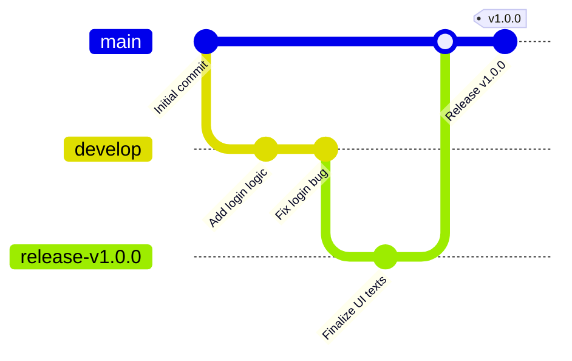

# Git Tags: Purpose, Advantages, and Usage

---

## 1. What Is a Git Tag?

A **Git tag** is a reference to a specific commit—typically used to mark important points in a project’s history such as version releases. Unlike branches, tags are **immutable**, meaning they do not move once created.

> Example: `v1.0.0` could mark your first production release.

---

## 2. Why Use Git Tags?

Git tags are especially valuable in collaborative and release-oriented development workflows. Here's why:

### 2.1. Version Control and Release Management

* Tag exact commits that represent stable or production-ready code.
* Clearly label milestones like `v1.0.0`, `v1.1.0-beta`, etc.
* Simplifies rollback and auditing of released code.

### 2.2. Immutable Reference Point

* Tags never move—providing a permanent pointer to the exact state of your repository.
* Unlike branches, they cannot be accidentally updated or overwritten.

### 2.3. CI/CD Workflow Integration

* Tags can trigger automated deployments via GitHub Actions, GitLab CI, Jenkins, etc.
* Ensures only tagged (i.e., explicitly released) versions are deployed to production.

### 2.4. Traceability and Clarity

* Tags make your repository history easier to interpret by clearly marking key events like MVP releases, public demos, hotfixes, and internal milestones.

### 2.5. Easy Checkout and Build Reproduction

```bash
git checkout v1.0.0
```

* Helpful for testing legacy behavior or reproducing historical builds.

---

## 3. Git Tagging in a Release Workflow



---

## 4. How to Use Git Tags

### Step 1: Make a Commit

```bash
git add .
git commit -m "Implement authentication flow"
```

---

### Step 2: Create a Tag

#### Annotated Tag (recommended)

```bash
git tag -a v1.0.0 -m "Release version 1.0.0"
```

* Includes author, date, and message
* Best for official releases

#### Lightweight Tag

```bash
git tag v1.0.0
```

* Simple reference, no metadata
* Not recommended for production usage

---

### Step 3: Push Tags to Remote

#### Push a Single Tag

```bash
git push origin v1.0.0
```

#### Push All Tags

```bash
git push --tags
```

---

### Bonus: Tag a Previous Commit

```bash
git log --oneline  # Find the commit hash
git tag -a v0.9.0 <commit-hash> -m "Retroactive tag"
```

---

## 5. Summary Table: Benefits of Git Tags

| Benefit                 | Description                                    |
| ----------------------- | ---------------------------------------------- |
| Versioning              | Label commits with version numbers for clarity |
| Immutability            | Tags are permanent, unlike branches            |
| CI/CD Compatibility     | Trigger pipelines and deployments using tags   |
| Historical Traceability | Make release milestones easy to identify       |
| Rollback Simplicity     | Roll back to exact tagged versions             |
| Lightweight Reference   | No runtime cost—purely a metadata pointer      |

---

## 6. Summary Table: Common Tag Commands

| Task                   | Command                                 |
| ---------------------- | --------------------------------------- |
| Create annotated tag   | `git tag -a v1.0.0 -m "Release v1.0.0"` |
| Create lightweight tag | `git tag v1.0.0`                        |
| Push single tag        | `git push origin v1.0.0`                |
| Push all tags          | `git push --tags`                       |
| Tag older commit       | `git tag -a vX.Y.Z <hash> -m "..."`     |
| View all tags          | `git tag`                               |
| View tag commit        | `git show v1.0.0`                       |
| Checkout a tag         | `git checkout v1.0.0`                   |
